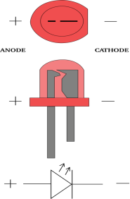
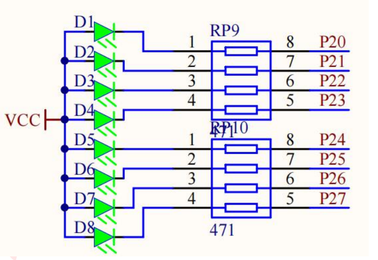
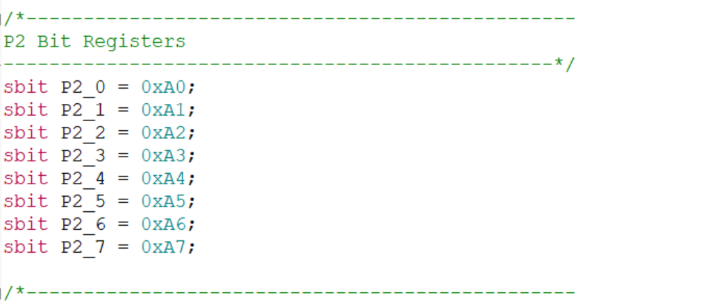
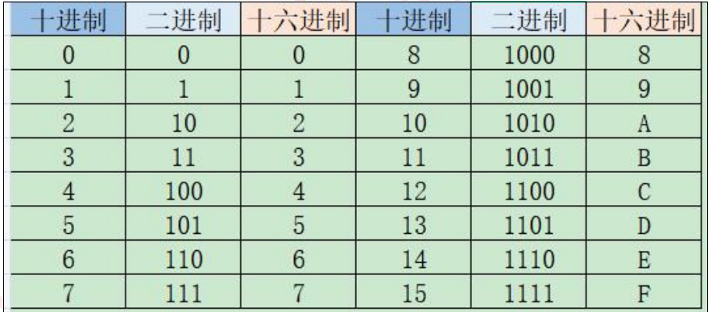
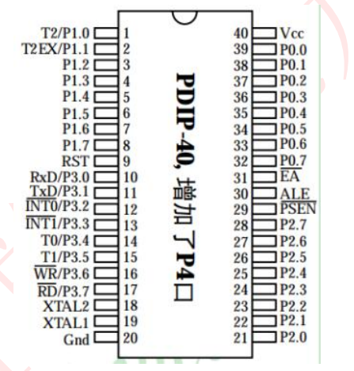

# 51单片机关于LED的学习
-----
<目录
- [ ] **LED的介绍**
- [ ] **点亮LED**
- [ ] **LED闪烁**
- [ ] **流水灯**
### 1.LED的介绍


-   发光二极管是一种把电能变成光能的半导体器件。它具有一个 PN 结与普通二极管一样，具有单向导电的特性。当给发光二极管加上正向电压，有一定的电流流过时就会发光。发光二极管是由磷砷化镓、镓铝砷等半导体材料制成的。当给PN 结加上正向电压时， P区的空穴进入到 N区，N区的电子进入到 P区，这时便产生了电子与空穴的复合，复合时便放出了能量，此能量就以光的形式表现出来。
-   ---
### 2.点亮LED
#### - *知识储备*
- 开发板上 LED 模块电路如下图所示：


 - 查看原理图，相同网络标号表示它们是连接在一起的，因此 D1-D8
连接到单片机的 P20-P27 口。图中 LED 采用共阳接法，即所有
LED 阳极管脚接电源 VCC，阴极管脚通过一个 470 欧的限流电阻接到 P2 口上。根据前面 LED 的介绍可知，要让 LED 发光即对应的阴极管脚应该为低电平，若为高电平则熄灭。如果要想 51 单片机控制 LED，就必须通过单片机管脚在 P2 口上输出低电平。

#### - *代码*
```c
//LED间隔闪烁
#include <REGX52.H>
void main()
{
	P2=0x55;//0101 0101
}
```
#### - *代码详解*
- 头文件<REGX52.H>为51 单片机的头文件 “sbit P2_0=0xA0（sbit 位变量名=位地址）;”语句的意思是，将 0xA0这个寄存器的最高位重新命名为P2_0，以后要单独操作P2寄存器的最高位时，便可直接操作 P2_0，其他雷同.
（sbit操作位，sfr操作一字节。如sbit P2_0=0xA0，sfr P2=0xA0）




---
### 3.LED闪烁

#### - *知识储备*

- LED亮灭速度过快，直接写会导致现象不明显，这时就要用到延时函数。
- 延时函数可以直接在keil等软件生成函数模板。

#### - *代码*
```c
#include <REGX52.H>
#include <INTRINS.H>
//延时函数
void Delay500ms()		//@12.000MHz
{
	unsigned char i, j, k;

	_nop_();
	i = 4;
	j = 205;
	k = 187;
	do
	{
		do
		{
			while (--k);
		} while (--j);
	} while (--i);
}
//LED以500毫秒为周期闪烁
void main()
{
	P2=0xFE;//1111 1110
	Delay500ms();
	P2=0xFF;//1111 1111
	Delay500ms();
	
}

```
---
### 4.流水灯

#### -*知识储备*
- 法一：要实现循环点亮，可以使用最容
易理解的方法：点亮 D1 且把 D2-D8 熄灭，延时一段时间后再点亮 D2 且把 D1、D3-D8 熄灭，延时一段时间后再点亮 D3 且把 D1-D2、D4-D8 熄灭，如此循环，这样就可以很简单的实现 LED 流水灯实验。
- 法二：运用c语言中移位的知识进行操作。根据流水灯实现原理，即 IO 口由低往高或者由高往低逐个输出低电平特点，可以将移位操作以及循环结合进来。

#### -*代码*
法一：
```c
#include <REGX52.H>
#include <INTRINS.H>
//模板延时函数
void Delay500ms()		//@12.000MHz
{
	unsigned char i, j, k;

	_nop_();
	i = 4;
	j = 205;
	k = 187;
	do
	{
		do
		{
			while (--k);
		} while (--j);
	} while (--i);
}

void main()
{
	while(1)
	{
		P2=0xFE;//1111 1110
		Delay500ms();
		P2=0xFD;//1111 1101
		Delay500ms();
		P2=0xFB;//1111 1011
		Delay500ms();
		P2=0xF7;//1111 0111
		Delay500ms();
		P2=0xEF;//1110 1111
		Delay500ms();
		P2=0xDF;//1101 1111
		Delay500ms();
		P2=0xBF;//1011 1111
		Delay500ms();
		P2=0x7F;//0111 1111
		Delay500ms();
	}	
}
	
```
**plus版**（自定义延时函数）
```c
#include <REGX52.H>
#include<INTRINS.H>
//自定义延时函数
void Delay1ms(unsigned int xms)		//@12.000MHz
{
	unsigned char i, j;
	
	while(xms)
	{
		i = 2;
		j = 239;
		do
		{
			while (--j);
		} while (--i);
		xms--;
	}
	
}


void main()
{
	while(1)
	{
		P2=0xFE;//1111 1110
		Delay1ms(1000);
		P2=0xFD;//1111 1101
		Delay1ms(1000);
		P2=0xFB;//1111 1011
		Delay1ms(100);
		P2=0xF7;//1111 0111
		Delay1ms(100);
		P2=0xEF;//1110 1111
		Delay1ms(100);
		P2=0xDF;//1101 1111
		Delay1ms(100);
		P2=0xBF;//1011 1111
		Delay1ms(100);
		P2=0x7F;//0111 1111
		Delay1ms(100);
	}
}
```
法二：
```c
#include <REGX52.H>
#include<INTRINS.H>
void Delay1ms(unsigned int xms)		//@12.000MHz
{
	unsigned char i, j;
	
	while(xms)
	{
		i = 2;
		j = 239;
		do
		{
			while (--j);
		} while (--i);
		xms--;
	}
	
}

void main()
{
	P2=0xFF;
	while(1)
	{
		
		int i=0;
		for(i=0;i<8;i++)
		{
			P2=~(0x01<<i);
			Delay1ms(500);
		}
	}
}

```
#### - 代码解析
- 进入 main 函数后，然后进入 while 循环，定义一个变量 i，由于要实现 8个 LED 从 D1->D8 循环点亮，因此可以使用 for 循环语句循环 8 次，每循环一次，点亮的小灯向右移动一个，而 D1-D8 是连接到 P2.0-P2.7 的，因此输出的低电平要左移一位，因此可以使用 P2=~(c0x01<<i);语句实现。0X01<<i 表示 i增加 1 次，0x01 中的 1 就移动多少位，因为 1（高电平）不会让 LED 点亮，需要取反后变为低电平 0 才能点亮，所以最后的结果需要取反后给 P2口，并且每次循环都要延时一段时间，这样才能分辨出来 LED 在流水。
- 建议采用法二，简介

----
### 5.知识获取
- **进制转换**

**方法**
*如二进制转十进制*:1111 1110B（二进制后缀）
$$
0*2^0+1*2^1+1*2^2+1*2^3+1*2^4+1*2^5+1*2^6+1*2^7
$$

- **GPIO的概念**
GPIO（general purpose intput output）是通用输入输出端口的简称，可以通过软件来控制其输入和输出。51 单片机芯片的 GPIO 引脚与外部设备连接起来，从而实现与外部通讯、控制以及数据采集的功能。不过 GPIO 最简单的应用还属点亮 LED 灯了，只需通过软件控制 GPIO 输出高低电平即可。当然 GPIO还可以作为输入控制，比如在引脚上接入一个按键，通过电平的高低判断按键是否按下。
开发板上使用的 51 单片机型号是 STC89C52 ，此芯片共有
40 引脚，如下：


- 并不是所以引脚都是IO口，51 单片机引脚可以分为这么几大类：
（1）电源引脚：引脚图中的 VCC、 GND 都属于电源引脚。
（2）晶振引脚：引脚图中的 XTAL1、XTAL2 都属于晶振引脚。
（3）复位引脚：引脚图中的 RST/VPD 属于复位引脚，不做其他功能使用。
（4）下载引脚：51 单片机的串口功能引脚（TXD、RXD）可以作为下载引脚
使用。
（5） GPIO 引脚：引脚图中带有 Px.x 等字样的均属于 GPIO 引脚。从引脚图可以看出，GPIO 占用了芯片大部分的引脚，共达 32 个，分为了 4 组，P0、P1、P2、P3，每组为 8 个 IO，而且在 P3 组中每个 IO 都具备额外功能，只要通过相应的寄存器设置即可配置对应的附加功能，同一时刻，每个引脚只能使用该引脚的一个功能。
