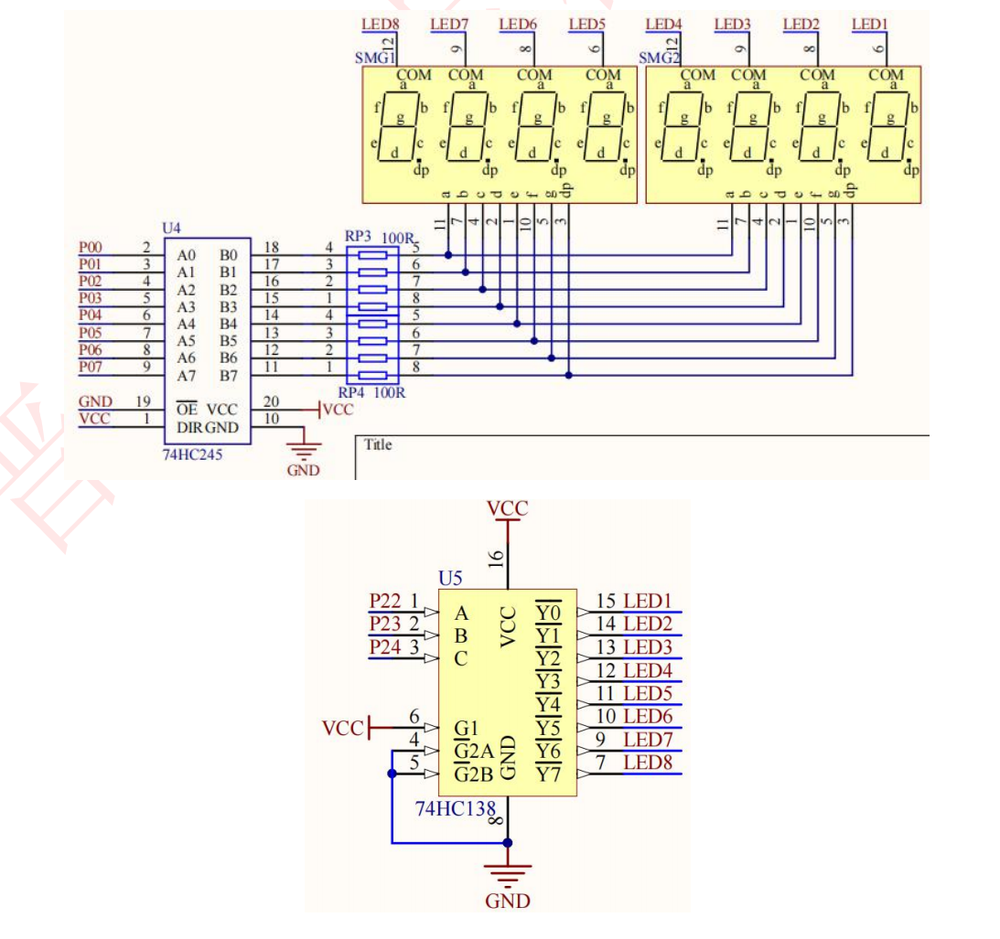

#### 1.动态显示原理
- 多位数码管依然可以静态显示，但是显示时要么只显示一位数码管，要么多位同时显示相同内容。当多位数码管应用于某一系统时，它们的“位选”是可独立控制的，而“段选”是连接在一起的，我们可以通过位选信号控制哪几个数码管亮，而在同一时刻，位选选通的所有数码管上显示的数字始终都是一样的，因为它们的段选是连接在一起的，送入所有数码管的段选信号都是相同的，所以它们显示的数字必定一样，数码管的这种显示方法叫做静态显示。
- 而动态显示，就是利用减少段选线，分开位选线，利用位选线不同时选择通断，改变段选数据来实现的。比如在第一次选中第一位数码管时，给段选数据 0，下一次位选中第二位数码管时显示 1。为了在显示 1 的时候，0 不会消失（当然实际上是消失了），必须在人肉眼观察不到的时间里再次点亮第一次点亮的 0。而这时就需要记住，人的肉眼正常情况下只能分辨变化超过 24ms 间隔的运动。
- 也就是说，在下一次点亮 0 这个数字的时间差不得大于 24ms。这时就会发现，数码管点亮是在向右或者向左一位一位点亮，形成了动态效果。如果把间隔时间改长就能直接展现这一现象。

- 开发板所用为共阴数码管，如果使用共阴数码管，需要注意增加单片机 IO 口驱动电流，因为共阴数码管是要靠单片机 IO 口输出电流来点亮的，但单片机 I/O 口难以输出稳定的、如此大的电流，所以数码管与单片机连接时需要加驱动电路，可以用上拉电阻的方法或使用专门的数码管驱动芯片，比如 74HC573、74HC245 等，其输出电流较大，电路接口简单。



- A、B、C输入就相当于 3 位 2 进制数，A 是低位，B 是次高位，C 是高位。而 Y0-Y7 具体哪一个输出有效电平，就看输入二进制对应的十进制数值。比如输入是 101（C，B，A），其对应的十进制数是 5，所以 Y5 输出有效电平（低电平）。
  
#### 2.代码块

案例：在液晶屏上显示123
```c
#include <REGX52.H>

unsigned char NixieTable[]={0x3F,0x06,0x5B,0x4F,0x66,0x6D,0x7D,0x07,0x7F,0x6F};

void Delay(unsigned int xms)		
{
	unsigned char i, j;
	
	while(xms)
	{
		i = 2;
		j = 239;
		do
		{
			while (--j);
		} while (--i);
		xms--;
	}
	
}
void Nixie(unsigned char Location,Number)
{
	switch(Location)
	{
		case(1):P2_4=1;P2_3=1;P2_2=1;break;
		case(2):P2_4=1;P2_3=1;P2_2=0;break;
		case(3):P2_4=1;P2_3=0;P2_2=1;break;
		case(4):P2_4=1;P2_3=0;P2_2=0;break;
		case(5):P2_4=0;P2_3=1;P2_2=1;break;
		case(6):P2_4=0;P2_3=1;P2_2=0;break;
		case(7):P2_4=0;P2_3=0;P2_2=1;break;
		case(8):P2_4=0;P2_3=0;P2_2=0;break;
	}
	P0=NixieTable[Number];
	Delay(1);
	P0=0x00;
}

void main()
{
	
	while(1)
	{
		Nixie(1,1);
		Nixie(2,2);
		Nixie(3,3);
		
	}
}

```
#### 3.代码分析

- 延时函数的使用：延时一定时间后在将段选口清零即消隐（消除之前的显示）
