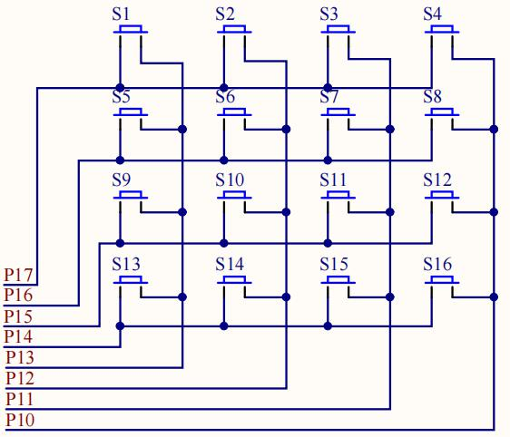

#### 1.矩阵按键
- 以下为4*4 矩阵键盘。开发板上将 16 个按键排成 4 行 4 列，第一行将每个按键的一端连接在一起构成行线，第一列将每个按键的另一端连接在一起构成列线，这样便一共有 4 行 4 列共 8 根线，将这 8 根线连接到单片机的 8 个 I/O 口上，通过程序扫描键盘就可检测 16 个键。
- 无论是独立键盘还是矩阵键盘，单片机检测其是否被按下的依据都是一样的，也就是检测与该键对应的 I/O 口是否为低电平。独立键盘有一端固定为低电平，此种方式编程比较简单。 而矩阵键盘两端都与单片机 I/O 口相连，因此在检测时需编程通过单片机 I/O 口送出低电平。检测方法有多种，最常用的是行列扫描和线翻转法。
- 以行列扫描法为例，检测时，先送一列为低电平，其余几列全为高电平(此时确定了列数)，然后立即轮流检测一次各行是否有低电平，若检测到某一行为低电平(这时又确定了行数)，则便可确认当前被按下的键是哪一行哪一列的，用同样方法轮流送各列一次低电平，再轮流检测一次各行是否变为低电平，这样即可检测完所有的按键，当有键被按下时便可判断出按下的键是哪一个键。当然也可以将行线置低电平，扫描列是否有低电平，从而达到整个键盘的检测。
- 从上图中可以看出，4*4 矩阵按键引出的 8 根控制线直接连接到 51 单片机的P1 口上。电路中的 P17 连接矩阵键盘的第 1 行，P13 连接矩阵键盘第 1 列。

#### 2.代码
- 本次使用模块化编程
