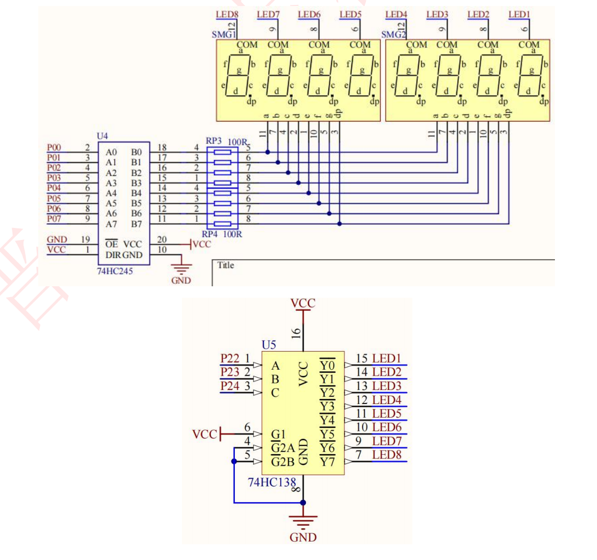

## 静态数码管


#### 1.数码管的介绍

- 数码管是一种半导体发光器件，其基本单元是发光二极管。按发光二极管单元连接方式可分为共阳极数码管和共阴极数码管。
- 共阳数码管是指将所有发光二极管的阳极接到一起形成公共阳极(COM)的数码管，共阳数码管在应用时应将公共极 COM 接到+5V，当某一字段发光二极管的阴极为低电平时，相应字段就点亮，当某一字段的阴极为高电平时，相应字段就不亮。
- 共阴数码管是指将所有发光二极管的阴极接到一起形成公共阴极(COM)的数码管，共阴数码管在应用时应将公共极 COM 接到地线 GND 上，当某一字段发光二极管的阳极为高电平时，相应字段就点亮，当某一字段的阳极为低电平时，相应字段就不亮。

#### 2.结构图
开发板上使用的数码管是 2 个四位一体的共阴极数码管（即 8 个 LED
的阳极全部并联一起引出，阴极分别引出如 A、 B...DP）



#### 3.代码块
案例：在第7个数码管显示3
```c
#include <REGX52.H>

unsigned char NixieTable[]={0x3F,0x06,0x5B,0x4F,0x66,0x6D,0x7D,0x07,0x7F,0x6F};
void Nixie(unsigned char Location,Number)
{
	switch(Location)
	{
		case(1):P2_4=1;P2_3=1;P2_2=1;break;
		case(2):P2_4=1;P2_3=1;P2_2=0;break;
		case(3):P2_4=1;P2_3=0;P2_2=1;break;
		case(4):P2_4=1;P2_3=0;P2_2=0;break;
		case(5):P2_4=0;P2_3=1;P2_2=1;break;
		case(6):P2_4=0;P2_3=1;P2_2=0;break;
		case(7):P2_4=0;P2_3=0;P2_2=1;break;
		case(8):P2_4=0;P2_3=0;P2_2=0;break;
	}
	P0=NixieTable[Number];
	
}

void main()
{
	Nixie(7,3);
	while(1)
	{
		
	}
}

```
#### 4.代码分析
```c
unsigned char NixieTable[]={0x3F,0x06,0x5B,0x4F,0x66,0x6D,0x7D,0x07,0x7F,0x6F};
```
- 列举显示0到9时P0口的值
```c
switch(Location)
	{
		case(1):P2_4=1;P2_3=1;P2_2=1;break;
		case(2):P2_4=1;P2_3=1;P2_2=0;break;
		case(3):P2_4=1;P2_3=0;P2_2=1;break;
		case(4):P2_4=1;P2_3=0;P2_2=0;break;
		case(5):P2_4=0;P2_3=1;P2_2=1;break;
		case(6):P2_4=0;P2_3=1;P2_2=0;break;
		case(7):P2_4=0;P2_3=0;P2_2=1;break;
		case(8):P2_4=0;P2_3=0;P2_2=0;break;
	}
```
- 选择在八个数码管中的哪一个上显示
